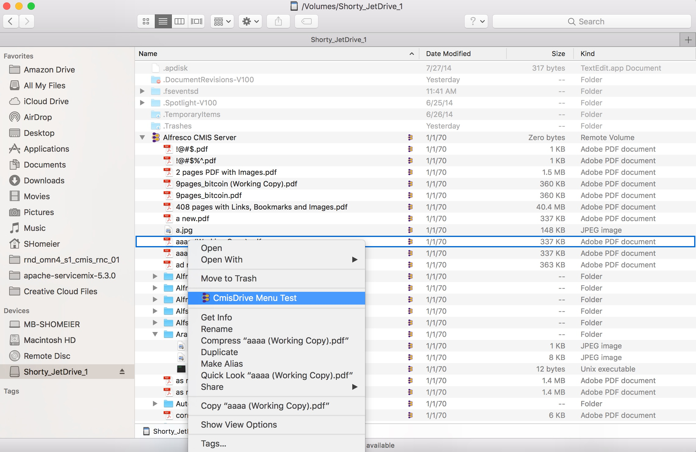
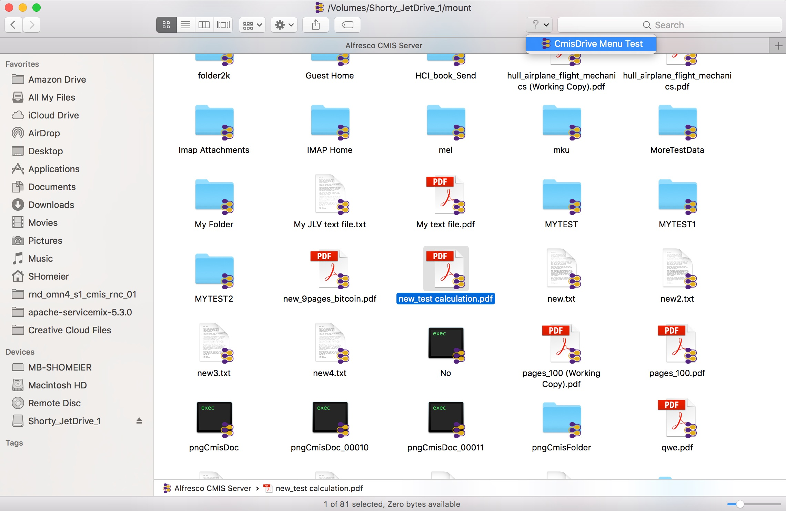

# CmisDrive

This is work in progress about how to mount a CMIS repository as FUSE Filesystem and using the FinderSync API to add context menus.
Currently only Mac supported.

Prerequisites:
<li> FUSE installed
<li> For now the FinderSync extension to add context menus need to be started manually from the Xcode project

Techniques used:
<li> javafs to mount an java.nio.Filesystem as FUSE drive (uses JNR for native calls)
<li> liferay-nativity to add context menus to finder

Projects:
<li> "sho.cmis.fs" contains the CMIS Filesystem which is an implementation of java.nio.file.FileSystem (and its Provider).
<li> "sho.cmis.drive" mount the CMIS Filesystem with javafs and initializes Nativity

## Screenshots

