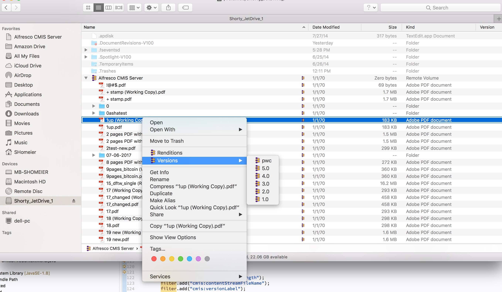

# Cmis Drive [EXPERIMENTAL]

Mount a CMIS repository into Finder.
This is work in progress about how to mount a CMIS repository as FUSE Filesystem and using the FinderSync API to add context menus.
Currently only Mac OS X supported.

## Prerequisites:
<li> FUSE installed
<li> For now the FinderSync extension to add context menus need to be started manually from the Xcode project

## Techniques used:
<li> javafs to mount an java.nio.Filesystem as FUSE drive (uses JNR for native calls)
<li> liferay-nativity to add context menus to finder

## Projects:
<li> "sho.cmis.fs" contains the CMIS Filesystem which is an implementation of java.nio.file.FileSystem (and its Provider).
<li> "sho.cmis.drive" mount the CMIS Filesystem with javafs and initializes Nativity

## Difficulties
1. Finder wants to create thumbnails for specific file types (I guess for those we have a Quicklook Plugin registered ?)
This results in READ requests to those files (e.g. JPGs), which in turn results to a CMIS call "getContent". This can lower the performance significantly (e.g. if we have very many big image files in a directory).
	* We can turn off icon previews by selecting the CMIS Mount and pressing 'CMD+J' -> Uncheck 'Show icon preview'. This needs to be done by the user manually!
	* We can store the files in a cache folder so that they only need to be downloaded once. In this case we need to handle TTL, Max Cache Size, etc
	* I am not sure but I heard that the .DS_Store file maybe can handle/control icon previews of a folder. If so we could create a .DS_store file for the folders automatically (needs research in .DS_Store file format)
2. Multi-Thread access to CMIS Filesystem via FUSE: Calls to the CMIS Java Filesystem implementation are done often from multiple different threads. In order that these calls do not always result in a remote call we need to have a thread-safe cache implementation which encapsulates and protects from remote calls. It is also possible to start FUSE in a single-thread mode (parameter '-s').
3. TypeDefinitionCache?

## Screenshots

